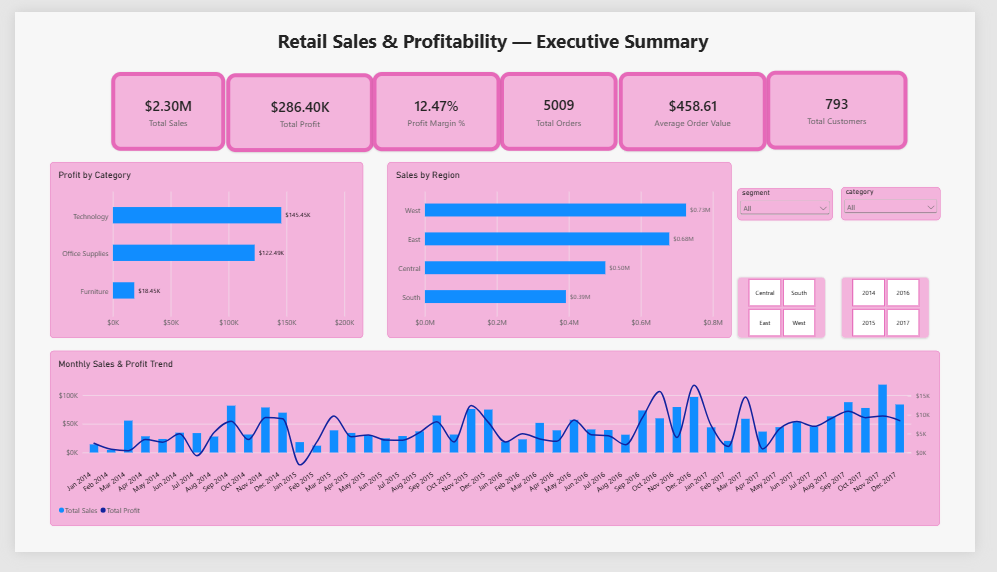
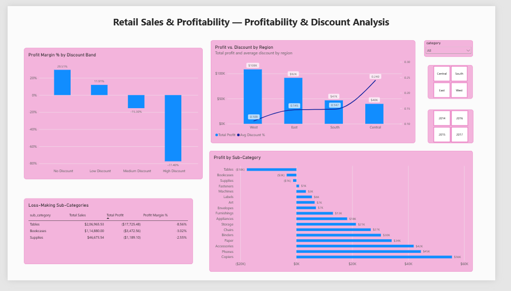
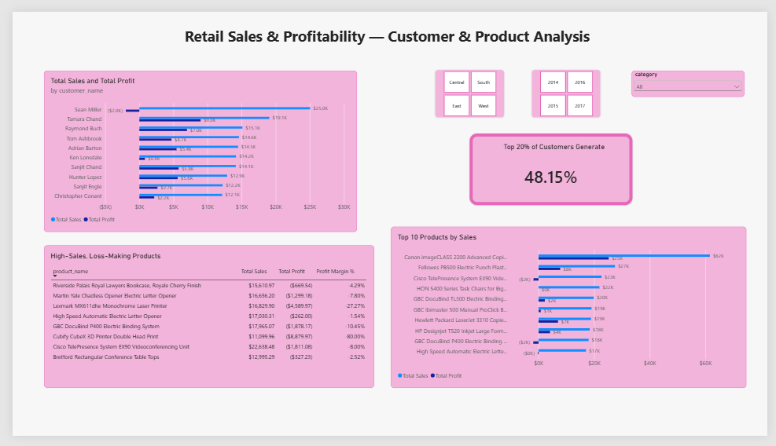

# Retail Sales & Profitability Analysis Using MySQL & Power BI

## Project Overview

This project analyzes retail sales and profitability data using MySQL and Power BI to answer practical business questions related to revenue, profit margins, customers, products, discounts, regions, and time-based performance.

The analysis was performed on the Sample Superstore dataset and focuses on using SQL to load, validate, and clean raw transactional data and transform it into business-relevant insights, with an interactive Power BI dashboard built on top of the cleaned data.

## Business Objective

The objective of this project is to understand:

- Overall sales and profitability performance
- Category and sub-category performance
- Regional differences in sales and profitability
- The relationship between discount levels and profitability
- Customer sales and profitability patterns
- Customer sales concentration
- Product-level sales and profitability
- High-sales but loss-making products
- Monthly sales and profitability trends

---

## Dataset

**Dataset:** [Sample Superstore (Kaggle)](https://www.kaggle.com/datasets/vivek468/superstore-dataset-final)

The dataset contains US retail order-level transaction data including:

- Order and customer information
- Product categories and sub-categories
- Geographic information
- Sales
- Quantity
- Discount
- Profit
- Order and shipping dates

All monetary values are in US dollars.

### Dataset Statistics

| Metric | Value |
|---|---:|
| Records | 9,994 |
| Orders | 5,009 |
| Customers | 793 |
| Units Sold | 37,873 |
| Total Sales | $2,297,200.86 |
| Total Profit | $286,397.02 |
| Overall Profit Margin | 12.47% |
| Date Range | 2014-01-03 to 2017-12-30 |

### Data Loading & Preparation

The CSV was loaded with `LOAD DATA INFILE` into an all-text staging table, then converted into a typed table so that no rows could be rejected during import. Text dates were converted to the `DATE` data type before performing time-series analysis, and sales, discount, and profit were stored as `DECIMAL`.

See [`data/README.md`](data/README.md) for full details.

### Data Quality & Cleaning

- The MySQL Workbench Import Wizard initially loaded only 9,694 of 9,994 rows. The gap was detected by comparing the row count with the maximum Row ID, and resolved by reloading the file with `LOAD DATA` into a text staging table.
- The source file is Windows-1252 encoded and is loaded with `CHARACTER SET latin1`.
- 225 records had product names containing hidden non-breaking spaces, which were replaced with normal spaces so identical products group correctly.
- Some product IDs are reused for different products, so products are grouped by both Product ID and Product Name.
- Checks were run for missing values, duplicate Row IDs, negative sales and profit values, and the date range.

---

## Tools & Technologies

- **MySQL 8.0**
- **MySQL Workbench**
- **SQL**
- **Power BI Desktop**
- **DAX**
- Sample Superstore Dataset

### SQL Concepts Used

- Data loading and cleaning (`LOAD DATA INFILE`, staging table, `CAST`, `STR_TO_DATE()`, `REPLACE()`)
- Aggregate functions and `GROUP BY` / `HAVING`
- `CASE` expressions (discount bands)
- Date functions
- Common Table Expressions (CTEs)
- Window functions: `ROW_NUMBER()`, `RANK() OVER (PARTITION BY ...)`, `LAG()`, `COUNT() OVER()`
- Profit-margin calculations as `SUM(Profit) / SUM(Sales)`
- Data validation queries

The full script is in [`sql/Retail_Sales_Profitability_Analysis.sql`](sql/Retail_Sales_Profitability_Analysis.sql), organized into setup, data validation, KPIs, category, regional, sub-category, discount, customer, product, and time-series sections.

### DAX Concepts Used

- A dedicated Date table (`CALENDAR()`), marked as the model's date table, related to the fact table
- `DIVIDE()` for safe ratio calculations (profit margin, average order value, sales concentration)
- Calculated columns (`SWITCH()` for discount bands)
- `RANKX()` for customer ranking, used to identify the top 20% of customers by sales
- Time-intelligence measures (`SAMEPERIODLASTYEAR()`) for year-over-year sales and profit growth
- `CALCULATE()` and `FILTER()` for the top-20%-of-customers sales contribution measure

---

## Analysis & Business Questions

### 1. What is the overall sales and profitability performance?

The dataset generated:

- $2.30M in total sales
- $286.40K in total profit
- 12.47% overall profit margin

### 2. Which product categories perform best?

Technology generated the highest total profit at **$145,454.95** and had the highest category-level profit margin at **17.40%**, narrowly ahead of Office Supplies (17.04%).

Furniture generated substantial sales but had a significantly lower profit margin of **2.49%**.

### 3. Which regions perform best?

The West region generated the highest sales and profit:

- Sales: **$725,457.82**
- Profit: **$108,418.45**
- Profit Margin: **14.94%**

Central had the lowest regional profit margin at **7.92%** and also the highest average discount (24.04%, compared with 10.93% in West). This is an association and does not by itself show that discounting caused the lower margin.

### 4. Which sub-categories are loss-making?

Three sub-categories generated negative total profit:

| Sub-Category | Total Profit |
|---|---:|
| Tables | -$17,725.48 |
| Bookcases | -$3,472.56 |
| Supplies | -$1,189.10 |

Tables was the largest absolute loss-making sub-category.

### 5. How does discounting relate to profitability?

The analysis found a strong association between higher discount bands and lower aggregate profitability.

| Discount Band | Profit Margin |
|---|---:|
| No Discount (0%) | 29.51% |
| Low Discount (up to 20%) | 11.91% |
| Medium Discount (20% to 40%) | -15.30% |
| High Discount (above 40%) | -77.40% |

The 1,393 records discounted above 20% produced a combined loss of about $135.4K.

For the Tables sub-category, profitability also declined substantially as discount levels increased.

These results represent observed relationships in the dataset and do not establish causation.

### 6. What is the Average Order Value?

The average order value was:

**$458.61**

The calculation uses distinct orders rather than transaction rows because the dataset contains multiple records per order.

### 7. Which customers generate the most sales and profit?

The highest-sales customer generated:

**$25,043.05 in sales**

while the highest-profit customer generated:

**$8,981.32 in profit**.

This demonstrates that sales volume and profitability can differ at the customer level.

### 8. Are any high-sales customers loss-making?

Yes.

For example, the highest-sales customer generated:

- Sales: **$25,043.05**
- Profit: **-$1,980.74**
- Profit Margin: **-7.91%**

This demonstrates why customer evaluation should consider profitability rather than sales alone.

### 9. How concentrated are customer sales?

The analysis ranked all **793 customers** by total sales.

The top approximately **20% (159 customers)** generated:

**$1,106,064.33**, representing **48.15% of total sales**.

That is about 2.4 times their share of the customer base, which indicates moderate concentration, weaker than a classic 80/20 pattern.

### 10. Which products generate the most sales and profit?

Product-level analysis was used to identify the top products by:

- Total sales
- Total profit
- Profit margin

The analysis also compared sales leadership with profitability to identify cases where high sales did not necessarily translate into positive profit.

### 11. Are there high-sales but loss-making products?

Products with:

- **Sales > $10,000**
- **Total Profit < $0**

were identified for further investigation.

The analysis identified **8 products** meeting these criteria.

One example was the Cubify CubeX 3D Printer Double Head Print:

- Sales: **$11,099.96**
- Profit: **-$8,879.97**
- Profit Margin: **-80.00%**

### 12. How does sales and profitability performance change over time?

Monthly analysis was performed using the converted `Order Date` field.

| Metric | Month | Value |
|---|---|---:|
| Highest Sales | November 2017 | $118,447.83 |
| Highest Profit | December 2016 | $17,885.31 |
| Lowest Profit | January 2015 | -$3,281.01 |

The highest-sales month and highest-profit month were different, demonstrating that revenue and profitability should be evaluated separately.

---

## Power BI Dashboard

An interactive 3-page Power BI dashboard was built on top of the cleaned `superstore` MySQL table, using DAX measures (`DIVIDE()`, `RANKX()`, calculated columns, time-intelligence functions) and slicers for Region, Year, and Category. The dashboard mirrors and visualizes the findings from the SQL analysis above.

### Page 1: Executive Summary

KPI cards (total sales, profit, margin, orders, customers, average order value), profit by category, sales by region, and a monthly sales & profit trend, with slicers for segment, category, region, and year.



### Page 2: Profitability & Discount Analysis

Profit margin by discount band, profit by sub-category (all sub-categories, not just the loss-making ones), a table of loss-making sub-categories, and a combo chart comparing regional profit against average discount, which visualizes the Central-region finding directly.



### Page 3: Customer & Product Analysis

Top customers and top products shown as sales and profit side by side, so a loss-making top performer (such as the highest-sales customer) is visible at a glance rather than requiring a separate table. Also includes the high-sales, loss-making products table and a card showing the top-20%-of-customers sales concentration.



The `.pbix` file is available in [`powerbi/Retail_Sales_Profitability_Dashboard.pbix`](powerbi/Retail_Sales_Profitability_Dashboard.pbix). Opening it in Power BI Desktop with a live refresh requires a connection to the `retail_analytics` MySQL database (see [`data/README.md`](data/README.md) for setup).

---

## Key Findings

1. **Technology** generated the highest category-level profit and margin (17.40%), narrowly ahead of Office Supplies (17.04%).
2. **Furniture** generated substantial sales but had a low **2.49% profit margin**.
3. **West** was the highest-performing region by sales, profit, and margin.
4. **Tables** was the largest loss-making sub-category.
5. Higher discount bands were associated with substantially lower aggregate profit margins.
6. The top approximately **20% of customers generated 48.15% of total sales**, a moderate level of concentration.
7. High sales at the customer or product level did not always correspond to positive profitability.
8. Monthly sales and profitability showed different peaks, reinforcing the need to track both metrics.

---

## Recommendations

Based on the findings, the following areas would be worth investigating further:

- **Review discounting above 20%,** where margins turn negative.
- **Investigate pricing and discounting for Tables and Bookcases,** both of which are loss-making.
- **Review discount practices in the Central region,** which has the lowest margin and the highest average discount.
- **Rank customers and products by profit as well as sales,** since the highest-sales customer is loss-making.

These are areas for further analysis. The data shows associations, not proven causes.

---

## How to Run

### SQL

1. Install **MySQL 8.0 or later** (the script uses CTEs and window functions).
2. Download the CSV from the [Kaggle source](https://www.kaggle.com/datasets/vivek468/superstore-dataset-final).
3. Copy the file into the folder returned by `SHOW VARIABLES LIKE 'secure_file_priv';`.
4. Update the file path in section 0.3 of the SQL script and run the script top to bottom in MySQL Workbench.
5. Confirm the load worked: query 1.1 should show 9,994 rows and `missing_rows = 0`.

### Power BI

1. Install **Power BI Desktop** and the MySQL Connector/NET driver.
2. Open [`powerbi/Retail_Sales_Profitability_Dashboard.pbix`](powerbi/Retail_Sales_Profitability_Dashboard.pbix).
3. If prompted, update the data source credentials to point at your local `retail_analytics` database.
4. Refresh the data (Home > Refresh) to pull the latest table contents.

---

## Repository Structure

```text
retail-sales-profitability-sql-powerbi/
│
├── README.md
│
├── sql/
│   └── Retail_Sales_Profitability_Analysis.sql
│
├── data/
│   └── README.md
│
├── insights/
│   └── Business_Questions.md
│
└── powerbi/
    ├── Retail_Sales_Profitability_Dashboard.pbix
    ├── page1_executive_summary.png
    ├── page2_discounts.png
    └── page3_customer_product.png
```
